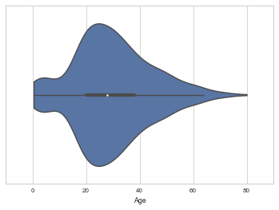

# DAND - Project 2 - Data Analysis

*This document and the accompanying files can be found on [GitHub](https://github.com/anenkov/dand-da-titanic)*

### This project will conduct a Data Analysis on the Titanic passengers' data


```python
import pandas as pd
import math
import matplotlib.pyplot as plt
import numpy as np
import seaborn as sns
from scipy.stats import ttest_ind
```


```python
# Set seaborn plots
sns.set(style="whitegrid", context="talk")
sns.set_context(rc={"figure.figsize": (8, 4)})

# load the data
passengers_df = pd.read_csv("titanic_data.csv")

passengers_df.head(3)
```


<div>
<table border="1" class="dataframe">
  <thead>
    <tr style="text-align: right;">
      <th></th>
      <th>PassengerId</th>
      <th>Survived</th>
      <th>Pclass</th>
      <th>Name</th>
      <th>Sex</th>
      <th>Age</th>
      <th>SibSp</th>
      <th>Parch</th>
      <th>Ticket</th>
      <th>Fare</th>
      <th>Cabin</th>
      <th>Embarked</th>
    </tr>
  </thead>
  <tbody>
    <tr>
      <th>0</th>
      <td>1</td>
      <td>0</td>
      <td>3</td>
      <td>Braund, Mr. Owen Harris</td>
      <td>male</td>
      <td>22</td>
      <td>1</td>
      <td>0</td>
      <td>A/5 21171</td>
      <td>7.2500</td>
      <td>NaN</td>
      <td>S</td>
    </tr>
    <tr>
      <th>1</th>
      <td>2</td>
      <td>1</td>
      <td>1</td>
      <td>Cumings, Mrs. John Bradley (Florence Briggs Th...</td>
      <td>female</td>
      <td>38</td>
      <td>1</td>
      <td>0</td>
      <td>PC 17599</td>
      <td>71.2833</td>
      <td>C85</td>
      <td>C</td>
    </tr>
    <tr>
      <th>2</th>
      <td>3</td>
      <td>1</td>
      <td>3</td>
      <td>Heikkinen, Miss. Laina</td>
      <td>female</td>
      <td>26</td>
      <td>0</td>
      <td>0</td>
      <td>STON/O2. 3101282</td>
      <td>7.9250</td>
      <td>NaN</td>
      <td>S</td>
    </tr>
  </tbody>
</table>
</div>


We are interested in several questions:
* Average survival rate and distribution in ages
* The survival rate of children (age 18 and under), adult males, adult females
* Survival rate by socio-economic status (Pclass)
* Does having Sibling or Spouse on the ship inrease/decrease survivability (SibSp > 0 or Parch > 0)
* Are there any tendencies for Port of Embarkation - e.g. survivors or dead concentration


```python
print "Rows count:"
passengers_df.count()
```

    Rows count:


    PassengerId    891
    Survived       891
    Pclass         891
    Name           891
    Sex            891
    Age            714
    SibSp          891
    Parch          891
    Ticket         891
    Fare           891
    Cabin          204
    Embarked       889
    dtype: int64


```python
survival_mean = passengers_df["Survived"].mean()
print "Survived {} out of {}".format(passengers_df["Survived"].sum(), passengers_df["Survived"].count())
print "Average probability of survival: {}".format(round(survival_mean, 2))
```

    Survived 342 out of 891
    Average probability of survival: 0.38


### Survivability by age bins


```python
# separate survivors and non survivors
survivors = passengers_df[passengers_df["Survived"] > 0]
non_survivors = passengers_df[passengers_df["Survived"] == 0]
```


```python
%matplotlib inline
# take all the passengers with 'Age' cleaning the NaN values
df_with_ages = passengers_df[pd.notnull(passengers_df['Age'])]

# group them by 10 years 
group_by_age = df_with_ages.groupby(
    pd.cut(df_with_ages['Age'], np.arange(0, 90, 10), include_lowest=False)
)

# Visualize age groups survivability
ax = sns.barplot(data=pd.DataFrame(group_by_age['Survived'].mean()).T)
ax.set_ylabel("Survivability")
```


    <matplotlib.text.Text at 0x116e97950>


### Survivability split in children, adult males and adult females


```python
# get datasets with children, males, females
children = df_with_ages[(df_with_ages['Age'] <= 18)]
adult_males = df_with_ages[(df_with_ages['Age'] > 18) & (df_with_ages['Sex'] == 'male')]
adult_females = df_with_ages[(df_with_ages['Age'] > 18) & (df_with_ages['Sex'] == 'female')]

# Combine the mean data into a dataframe
surv_data = pd.DataFrame([
        [children['Survived'].mean(),adult_males['Survived'].mean(), adult_females['Survived'].mean()]
    ], index=["Survivability"], columns=["Children", "Adult males", "Adult females"]).round(2)
surv_data
```


<div>
<table border="1" class="dataframe">
  <thead>
    <tr style="text-align: right;">
      <th></th>
      <th>Children</th>
      <th>Adult males</th>
      <th>Adult females</th>
    </tr>
  </thead>
  <tbody>
    <tr>
      <th>Survivability</th>
      <td>0.5</td>
      <td>0.18</td>
      <td>0.78</td>
    </tr>
  </tbody>
</table>
</div>


```python
# Visualize the survivability mean
ax = sns.barplot(data=surv_data)
ax.set_ylabel("Survivability")
```


    <matplotlib.text.Text at 0x119868890>





### Survival rate by socio-economic status (Pclass)


```python
# Group passengers by Pclass and calculate the mean of survivability for each Pclass
class_surv_data = pd.DataFrame(passengers_df.groupby('Pclass')['Survived'].mean()).T
class_surv_data
```


<div>
<table border="1" class="dataframe">
  <thead>
    <tr style="text-align: right;">
      <th>Pclass</th>
      <th>1</th>
      <th>2</th>
      <th>3</th>
    </tr>
  </thead>
  <tbody>
    <tr>
      <th>Survived</th>
      <td>0.62963</td>
      <td>0.472826</td>
      <td>0.242363</td>
    </tr>
  </tbody>
</table>
</div>


```python
ax = sns.barplot(data=class_surv_data)
ax.set_ylabel("Survivability")
```


    <matplotlib.text.Text at 0x1198fc850>


### Here we'll test if the chance of surviving between those who have relatives and those who don't is statistically significant at α = 0.01


```python
print u'H\u2080: \u039Chr = \u039cnhr          H\u2081: \u039Chr \u2260 \u039cnhr          \u03B1 = .01'
```

    H₀: Μhr = Μnhr          H₁: Μhr ≠ Μnhr          α = .01


```python
# separate those having relatives (hr) from those who don't (nhr)
having_relatives = passengers_df[(passengers_df['SibSp'] > 0) | (passengers_df['Parch'] > 0)]['Survived']
not_having_relatives = passengers_df[(passengers_df['SibSp'] == 0) & (passengers_df['Parch'] == 0)]['Survived']

print having_relatives.describe()
print not_having_relatives.describe()
```

    count    354.000000
    mean       0.505650
    std        0.500676
    min        0.000000
    25%        0.000000
    50%        1.000000
    75%        1.000000
    max        1.000000
    Name: Survived, dtype: float64
    count    537.000000
    mean       0.303538
    std        0.460214
    min        0.000000
    25%        0.000000
    50%        0.000000
    75%        1.000000
    max        1.000000
    Name: Survived, dtype: float64


```python
## Get the means
hr_xbar = having_relatives.mean()
nhr_xbar = not_having_relatives.mean()

# Calculate Sum of Squares for samples
ss_hr = np.sum((having_relatives - hr_xbar) ** 2)
ss_nhr = np.sum((not_having_relatives - nhr_xbar) ** 2)

# Degree of Freedom
dof = having_relatives.count() + not_having_relatives.count() - 2
print "Degree of freedom: {}".format(dof)
# Pooled Variance
pooled_var = (ss_hr + ss_nhr)/dof

# Standared Error
st_err = math.sqrt(pooled_var/having_relatives.count() + pooled_var/not_having_relatives.count())

# t-statistic
t_statistic = (hr_xbar - nhr_xbar)/st_err
print "t-statistic: {}".format(round(t_statistic,2))

# t-critical 
t_critical = 2.581
print "t-critical: {}".format(t_critical)

# Margin of Error
margin_of_error = t_critical * st_err
```

    Degree of freedom: 889
    t-statistic: 6.19
    t-critical: 2.581


** The two-tailed P value is less than 0.0001 **  
** By conventional criteria, this difference is considered to be extremely statistically significant. **  
** *Based on the result Μhr ≠ Μnhr and we can reject the null hypotheses. * **


```python
CI_left = hr_xbar - nhr_xbar - margin_of_error
CI_right = hr_xbar - nhr_xbar + margin_of_error
print "CI(99%) = ({}, {})".format(CI_left, CI_right)
```

    CI(99%) = (0.117879804282, 0.286343280653)


** *We are 99% sure that people who have relatives on criuses have between 12% and 29% higher chance of surviving in case of a shipwreck* **


```python
# Another way of computing the t-statistic and p-value would be this one 
# but I did the above because of the confidence intervals
t, p = ttest_ind(having_relatives, not_having_relatives)
"t-statistic: {}, p-value: {}".format(t,p)
```


    't-statistic: 6.19303248808, p-value: 9.00949017933e-10'


### Examine distribution of people on embarkment


```python
# Get the means
embarkation_mean = passengers_df.groupby('Embarked').mean()[['Survived', 'Pclass', 'Fare','Age']]
embarkation_mean
```


<div>
<table border="1" class="dataframe">
  <thead>
    <tr style="text-align: right;">
      <th></th>
      <th>Survived</th>
      <th>Pclass</th>
      <th>Fare</th>
      <th>Age</th>
    </tr>
    <tr>
      <th>Embarked</th>
      <th></th>
      <th></th>
      <th></th>
      <th></th>
    </tr>
  </thead>
  <tbody>
    <tr>
      <th>C</th>
      <td>0.553571</td>
      <td>1.886905</td>
      <td>59.954144</td>
      <td>30.814769</td>
    </tr>
    <tr>
      <th>Q</th>
      <td>0.389610</td>
      <td>2.909091</td>
      <td>13.276030</td>
      <td>28.089286</td>
    </tr>
    <tr>
      <th>S</th>
      <td>0.336957</td>
      <td>2.350932</td>
      <td>27.079812</td>
      <td>29.445397</td>
    </tr>
  </tbody>
</table>
</div>


The only interesting thing we can see from the above table is that most of the people that have been Embarked in Cherbourg were rich. But from the table below we can see they were not as many as Southampton


```python
# Display distribution by Pclass
sns.countplot(x="Embarked", hue="Pclass", data=passengers_df);
```


```python
# Display survivors location
sns.countplot(x="Embarked", hue="Pclass", data=passengers_df[passengers_df['Survived'] == 1], order=['S', 'C', 'Q'])
```


    <matplotlib.axes._subplots.AxesSubplot at 0x119d83a50>


```python
# Display non-survivors location
sns.countplot(x="Embarked", hue="Pclass", data=passengers_df[passengers_df['Survived'] != 1], order=['S', 'C', 'Q']);
```


We can see from the above graphics that most bodies Embarked in Southampton

Sources:
  1. [Titanic passengers' data and description](https://www.kaggle.com/c/titanic/data)


```python

```
